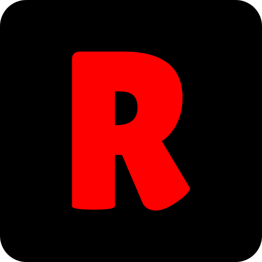

<!-- Improved compatibility of back to top link: See: https://github.com/othneildrew/Best-README-Template/pull/73 -->

<!-- PROJECT LOGO -->
 

  

  <h3 align="center">RetroChirp</h3>

  

     
    <a href="https://github.com/othneildrew/Best-README-Template">View Demo</a>
    <a href="https://github.com/othneildrew/Best-README-Template/issues">Request Feature</a>
  

<!-- TABLE OF CONTENTS -->

  
Table of Contents

  <ol>
    <li>
      <a href="#about-the-project">About The Project</a>
      <ul>
        <li><a href="#built-with">Built With</a></li>
      </ul>
    </li>
    <li><a href="#contributing">Contributing</a></li>
    <li><a href="#license">License</a></li>
  </ol>

<!-- ABOUT THE PROJECT -->
## About The Project

RetroChirp is a vibrant social platform designed to ignite discussions and foster connections within the gaming and tech enthusiast community. Drawing inspiration from the nostalgic charm of early online forums and bulletin boards, RetroChirp aims to capture the essence of retro gaming culture while embracing modern features and functionalities.

### Built With

This section should list any major frameworks/libraries used to bootstrap your project. Leave any add-ons/plugins for the acknowledgements section. Here are a few examples.

#### Frontend:
- [![React][React.js]][React-url]
- [![MUI][MUI]][MUI-url]
- [![React Router][React Router]][React Router-url]
- [![React Dropzone][React Dropzone]][React Dropzone-url]

#### Backend:
- [![Node.js][Node.js]][Node-url]
- [![Express][Express.js]][Express-url]
- [![MongoDb][MongoDb]][MongoDb-url]
- [![Nodemon][Nodemon]][Nodemon-url]
- [![JsonWebToken][JsonWebToken]][JsonWebToken-url]
- [![Multer][Multer]][Multer-url]
- [![Socket.io][Socket.io]][Socket-url]

(<a href="#readme-top">back to top</a>)

<!-- CONTRIBUTING -->
## Contributing

Contributions are what make the open source community such an amazing place to learn, inspire, and create. Any contributions you make are **greatly appreciated**.

If you have a suggestion that would make this better, please fork the repo and create a pull request. You can also simply open an issue with the tag "enhancement".
Don't forget to give the project a star! Thanks again!

1. Fork the Project
2. Create your Feature Branch (`git checkout -b feature/AmazingFeature`)
3. Commit your Changes (`git commit -m 'Add some AmazingFeature'`)
4. Push to the Branch (`git push origin feature/AmazingFeature`)
5. Open a Pull Request

(<a href="#readme-top">back to top</a>)

<!-- LICENSE -->
## License

Distributed under the MIT License. See `LICENSE.txt` for more information.

(<a href="#readme-top">back to top</a>)

<!-- MARKDOWN LINKS & IMAGES -->
<!-- https://www.markdownguide.org/basic-syntax/#reference-style-links -->
[React.js]: https://img.shields.io/badge/React-%2361DAFB.svg?style=for-the-badge&logo=react&logoColor=white
[Node.js]: https://img.shields.io/badge/Node.js-%23339933.svg?style=for-the-badge&logo=node.js&logoColor=white
[Express.js]: https://img.shields.io/badge/Express.js-%23000000.svg?style=for-the-badge
[MongoDb]: https://img.shields.io/badge/MongoDB-%2347A248.svg?style=for-the-badge&logo=mongodb&logoColor=white
[Socket.io]: https://img.shields.io/badge/Socket.io-%23000000.svg?style=for-the-badge&logo=socket.io&logoColor=white
[MUI]: https://img.shields.io/badge/MUI-%230081CB.svg?style=for-the-badge&logo=mui&logoColor=white

[React-url]: https://reactjs.org/
[Node-url]: https://nodejs.org/
[Express-url]: https://expressjs.com/
[MongoDb-url]: https://www.mongodb.com/
[Socket-url]: https://socket.io/
[MUI-url]: https://mui.com/

[Redux Toolkit]: https://img.shields.io/badge/Redux_Toolkit-%23764ABC.svg?style=for-the-badge
[React Router]: https://img.shields.io/badge/React_Router-%2320232A.svg?style=for-the-badge&logo=react-router&logoColor=white
[Redux Persist]: https://img.shields.io/badge/Redux_Persist-%234B32C3.svg?style=for-the-badge
[React Dropzone]: https://img.shields.io/badge/React_Dropzone-%232D88FF.svg?style=for-the-badge&logo=react&logoColor=white
[Nodemon]: https://img.shields.io/badge/Nodemon-%2335495E.svg?style=for-the-badge&logo=nodemon&logoColor=white
[JsonWebToken]: https://img.shields.io/badge/Json_Web_Token-%232C3A42.svg?style=for-the-badge
[Multer]: https://img.shields.io/badge/Multer-%2383D3D6.svg?style=for-the-badge
[Formik]: https://img.shields.io/badge/Formik-%23308BAC.svg?style=for-the-badge
[Yup]: https://img.shields.io/badge/Yup-%230066CC.svg?style=for-the-badge

[Redux Toolkit-url]: https://redux-toolkit.js.org/introduction/overview
[React Router-url]: https://reactrouter.com/en/v6.3.0/getting-started/introduction
[Redux Persist-url]: https://github.com/rt2zz/redux-persist
[React Dropzone-url]: https://react-dropzone.js.org/
[Nodemon-url]: https://github.com/remy/nodemon
[JsonWebToken-url]: https://jwt.io/
[Multer-url]: https://github.com/expressjs/multer
[Formik-url]: https://formik.org/docs/overview
[Yup-url]: https://github.com/jquense/yup
